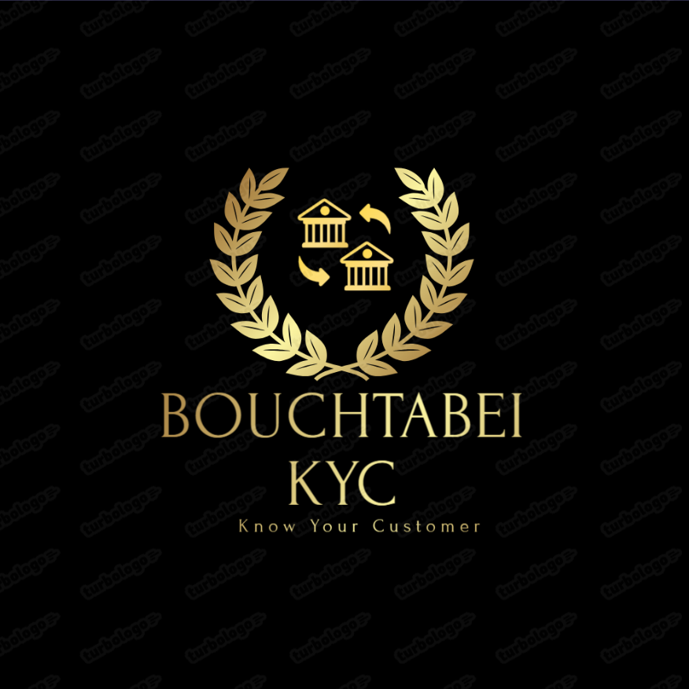

# Hedera-KYC-App
<p align="center">
  
</p>

<p align="center">
  <b>Interactive KYC — Mauritania’s Unified Banking Identity System</b>
</p>

<p align="center">
  
  
  
  
  
  
  
  
  
  
</p>

<p align="center">
  <a href="https:[//youtu.be/Ad44riH5CgI?si=7QZl6KbmuON2DiJr](https://youtu.be/tO3fOZvSzaA)" target="_blank">
    
  </a>
  <br />
  <a href="[https://youtu.be/Ad44riH5CgI?si=7QZl6KbmuON2DiJr](https://youtu.be/tO3fOZvSzaA)" target="_blank"><b>▶ Watch the 2‑minute demo</b></a>
</p>

## Overview

Interactive KYC is a secure, privacy‑preserving prototype that enables all banks in Mauritania to share a single verified customer identity (KYC) record — speeding onboarding, cutting compliance costs, and supporting national financial inclusion.

## Problem

- Each bank runs its own siloed onboarding system.
- Customers must repeat identity verification for every bank.
- Manual checks slow account opening and increase cost.
- Regulators lack unified, auditable visibility across institutions.

Result: onboarding can take days, discouraging users and limiting access to financial services.

## Solution

National‑level, multi‑bank KYC that synchronizes identity verification across all participating banks:

- Single submission of NNI and ID documents.
- Parallel review by multiple banks (automatic + manual).
- Final approval once all banks confirm compliance.
- Tamper‑proof proof recorded on Hedera.
- Encrypted, privacy‑first storage — no PII on the ledger.

Banks save time, regulators gain real‑time insight, and users onboard faster — securely and transparently.

## How It Works (Flow)

1. User submission: upload NNI and ID documents once.
2. Bank review: each bank reviews under its own policy (auto/manual).
3. Aggregation: platform merges results into a unified summary.
4. Proof creation: cryptographic summary is published on Hedera.
5. Data lifecycle: files are encrypted and deleted after short retention.

→ One national identity. One trusted proof.

## Core Features

- Unified, multi‑bank KYC workflow.
- Bank‑controlled review modes (automatic + manual).
- Local AI modules for document and face verification.
- Privacy‑first: encryption, short retention, zero public PII.
- Central Bank dashboard (auditable and analytic).
- Modular APIs for quick integration with bank systems.

## Architecture (v1)

- Frontend: React + Vite + TypeScript — responsive Arabic/English UI.
- Backend: Node.js + Prisma + PostgreSQL.
- Jobs: Redis + BullMQ for async tasks (AI/ledger ops).
- Storage: encrypted MinIO (S3‑compatible).
- AI: Face embeddings + Whisper/LLM for analysis and verification.
- Ledger: Hedera Hashgraph for tamper‑proof summary proofs.

## Why Now / Differentiation

- Regulatory momentum: Central Bank e‑KYC frameworks (Oct 2025).
- National impact: interoperability across financial institutions.
- Privacy by design: no personal data on the public chain.
- Local‑first: Arabic support, national context, compliant by design.
- Future‑ready: extensible for fintech and digital ID integrations.

## Business Model

- Annual subscription (per bank): platform + dashboard access.
- Licensed reports (Central Bank): compliance/analytics under yearly contracts.
- Professional services (optional): integration, audit, regulatory alignment.

## Roadmap

- 0–3 months: expand prototype with five simulated bank environments and local AI modules.
- 3–6 months: pilot with partner banks + Central Bank sandbox.
- 6–12 months: full audit dashboard, data‑sharing APIs, production deployment.

## KPIs

- >60% reduction in average onboarding time.
- >98% cross‑bank verification accuracy.
- Zero data leaks or unauthorized ledger disclosures.
- Positive feedback from regulators and banks.

---

## Prerequisites

- Docker Desktop + Docker Compose
- Node.js 18+ and npm
- Windows users: WSL2 is recommended for local development

## Quick Start

1) Configure environment and secrets:

```bash
# from repo root
cp env.example .env
cp env.example .env.docker   # required for Docker services
bash scripts/generate-secrets.sh
```

2) Start everything with one command:

```bash
bash scripts/start.sh
```

3) Check system health:

```bash
bash scripts/check_system.sh
```

4) Stop safely:

```bash
bash scripts/stop.sh
```

### Default Ports

- Frontend: `http://localhost:5173`
- Backend API: `http://localhost:3000`
- MinIO Console: `http://localhost:9001` (object storage on `9000`)
- PostgreSQL Citizens: `localhost:5432`
- PostgreSQL Banks: `localhost:5433`
- Redis: `localhost:6379`

### Test Credentials

- Username: `admin`
- Password: `admin123`

---

## Monorepo Structure

```bash
.
├─ backend/
│  ├─ src/
│  │  ├─ app.ts                 # Express setup: security, CORS, CSRF, routes under /api
│  │  ├─ index.ts               # Bootstrap: Redis + DBs + MinIO + Hedera + Queues + Workers
│  │  ├─ routes/                # auth, kyc, admin, asr, llm, status, health, export, hedera
│  │  ├─ controllers/           # HTTP controllers
│  │  ├─ services/              # AI, Hedera, KYC, ASR, Export services
│  │  ├─ lib/                   # database, minio, redis, crypto, validator
│  │  ├─ workers/               # BullMQ workers
│  │  ├─ queues/                # BullMQ queues
│  │  └─ utils/, types/
│  ├─ prisma/
│  │  ├─ schema/{citizens,baybank,oasisbank,zenbank,arcbank,nexbank}/schema.prisma
│  │  └─ src/generated/**       # Generated Prisma clients per bank
│  └─ package.json
│
├─ frontend/
│  ├─ src/
│  │  ├─ pages/                 # Landing, KycStart, ReviewPage, ...
│  │  ├─ components/            # UI, forms, tables, charts, FaceModelLoader
│  │  ├─ hooks/                 # useAuth, useKYC, useFaceRecognition
│  │  ├─ lib/                   # api, cryptoClient
│  │  └─ utils/                 # faceDetection, typeGuards
│  ├─ public/models/            # Face models (auto-downloaded)
│  └─ package.json
│
├─ infra/
│  └─ docker-compose.yml        # Postgres (Citizens/Banks) + Redis + MinIO + Backend
│
├─ scripts/
│  ├─ start.sh                  # Orchestrates Docker, installs deps, Prisma, starts FE/BE
│  ├─ stop.sh                   # Stops FE/BE and containers, cleans PIDs
│  ├─ check_system.sh           # Health checks for running services
│  └─ generate-secrets.sh       # Generates strong secrets and syncs envs
│
├─ env.example
├─ creds.local.json.example
└─ logo.png
```

---

## Backend

- Entry point: `backend/src/index.ts` initializes Redis/sessions, databases, MinIO, Hedera (or simulation), queues/workers, then starts the server.
- Security: Helmet, rate‑limiting, CSRF with cookie‑based tokens, JSON limits.

### Key API Routes (all under `/api`)

- `GET /api/health` — health check
- `GET /api/csrf-token` — obtain CSRF token for state‑changing requests
- `POST /api/auth/*` — login/logout, JWT, session
- `POST /api/kyc/*` — KYC request lifecycle, encrypted file uploads
- `GET/POST /api/admin/*` — admin dashboard, aggregation, approvals
- `POST /api/asr/*` — audio upload for speech‑to‑text (Whisper/ASR)
- `POST /api/llm/*` — LLM‑assisted analysis/summary
- `POST /api/hedera/*` — create/publish proofs on Hedera
- `GET /api/export/*` — exports and reports
- `GET /api/status/*` — system and queues status

### Database/Prisma Commands

```bash
# from backend/
npm run db:generate:all   # generate Prisma clients for all schemas
npm run db:push:all       # push schemas to Postgres (skips generate for speed)
npm run db:migrate:all    # apply migrations (if present)
```

### Environment Variables (examples)

- `JWT_SECRET`, `JWT_REFRESH_SECRET` — JWT signing keys
- `AES_KEY` — encryption key for sensitive blobs
- `NNI_SALT` — salt used for hashing NNI
- `DATABASE_URL_CITIZENS`, `DATABASE_URL_{BANK}` — per‑DB URLs
- `REDIS_URL` — Redis connection string
- `MINIO_ENDPOINT`, `MINIO_PORT`, `MINIO_ACCESS_KEY`, `MINIO_SECRET_KEY`, `MINIO_BUCKET`, `MINIO_USE_SSL`
- `FRONTEND_URL` — CORS allowlist for the SPA
- `HEDERA_OPERATOR_ID`, `HEDERA_OPERATOR_KEY` — enable on‑chain proofs
- `OPENAI_API_KEY` — enable ASR/LLM features

---

## Frontend

- Stack: React + Vite + TypeScript + Tailwind.
- First‑time face model download:

```bash
# from frontend/
npm run download-models
```

Development (auto‑started by `start.sh`):

```bash
npm run dev
# opens http://localhost:5173
```

---

## Infrastructure

`infra/docker-compose.yml` runs:

- Two PostgreSQL instances: Citizens (`5432`) and Banks (`5433`)
- Redis (`6379`)
- MinIO (`9000` with Console at `9001`)
- Backend (exposed on `3000`) with container‑aware env vars

Note: During development the backend can also run locally while consuming Docker services via container names.

---

## Security & Privacy

- No personal data stored on the public chain (Hedera) — only cryptographic proofs.
- Encrypted object storage with short retention policies.
- CSRF protection, rate limiting, strict security headers via Helmet.

---

## Troubleshooting

- Backend logs: `tail -f /tmp/kyc_backend.log`
- Frontend logs: `tail -f /tmp/kyc_frontend.log`
- System check: `bash scripts/check_system.sh`

If first‑run fails:

1) Ensure `.env` and `.env.docker` exist, then run: `bash scripts/generate-secrets.sh`.
2) Retry: `bash scripts/start.sh`.

---

## Contact

`23067@supnum.mr`

Interactive KYC is a working prototype demonstrated to sector stakeholders with encouraging feedback. We are seeking pilot partnerships with banks and the Central Bank of Mauritania to validate the model and measure impact.

---

## Demo Video

Watch the demo on YouTube: https: [//youtu.be/Ad44riH5CgI?si=7QZl6KbmuON2DiJr](https://youtu.be/tO3fOZvSzaA)


